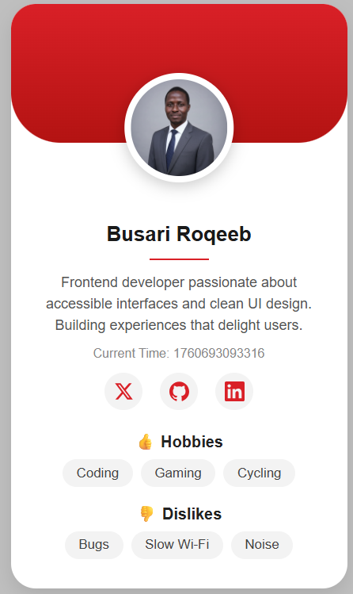

# 🪪 Profile Card

A clean, modern **Profile Card** built with pure HTML, CSS, and a touch of JavaScript.  
Inspired by minimalist portfolio styles — featuring a gradient header, circular avatar, and SVG social icons.



---

## 🌐 Live Demo
**👉 [View Live Project](https://callerstudios.github.io/profile-card/)**  

---

## ✨ Features
- Responsive card layout with smooth shadows and rounded edges  
- Dynamic timestamp using vanilla JavaScript  
- Inline SVG social media icons (Twitter/X, GitHub, LinkedIn)  
- Fully customizable color theme and gradient background  

---

## 🧰 Tech Stack
- **HTML5**
- **CSS3**
- **JavaScript (Vanilla)**

---

## 📦 How to Run Locally

1. **Clone this repository**
   ```bash
   git clone https://github.com/callerstudios/profile-card.git

2. Navigate into the folder
   ```bash
   cd profile-card

3. Open index.html in browser
    double click the file 
        or
    start a local server
    ```bash
        npx serve
    then visit http://localhost:3000 or visit http://localhost:5500
